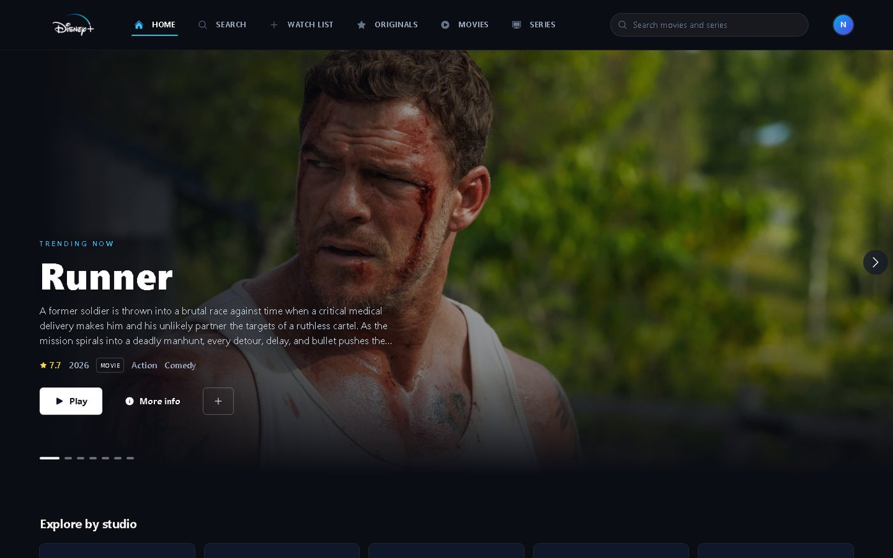
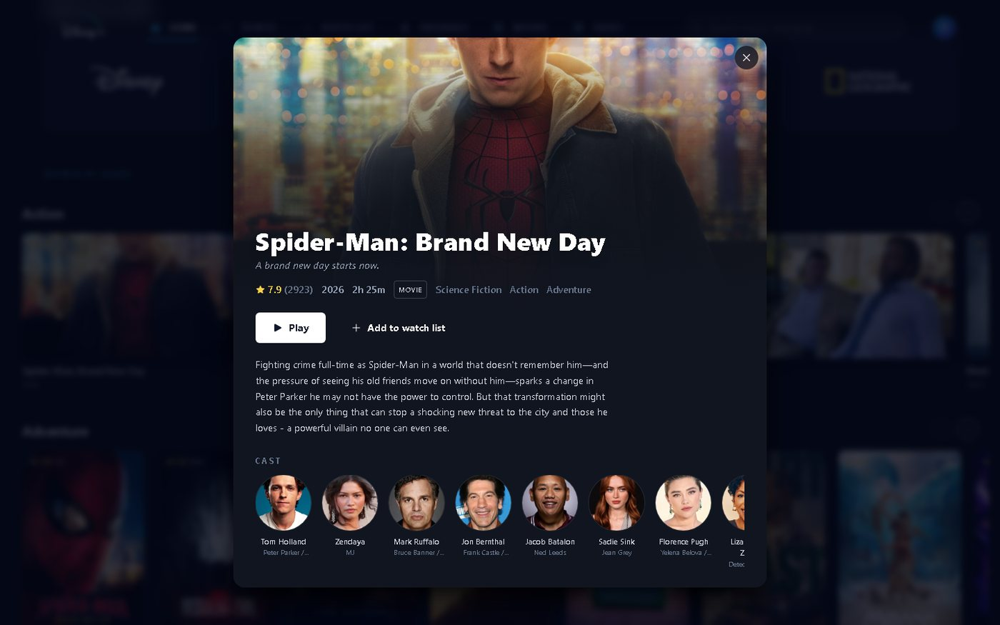
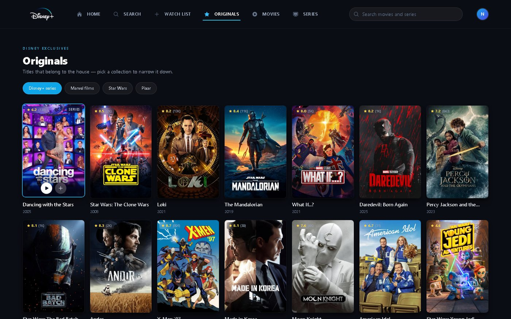
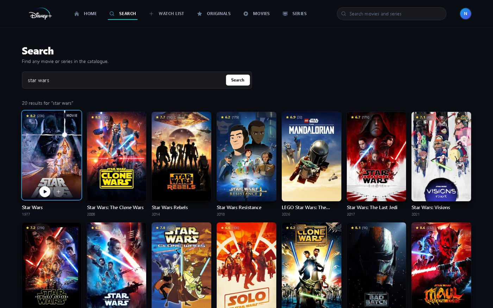
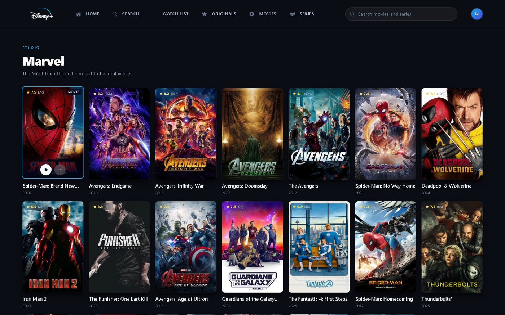
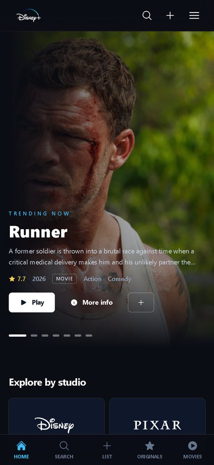
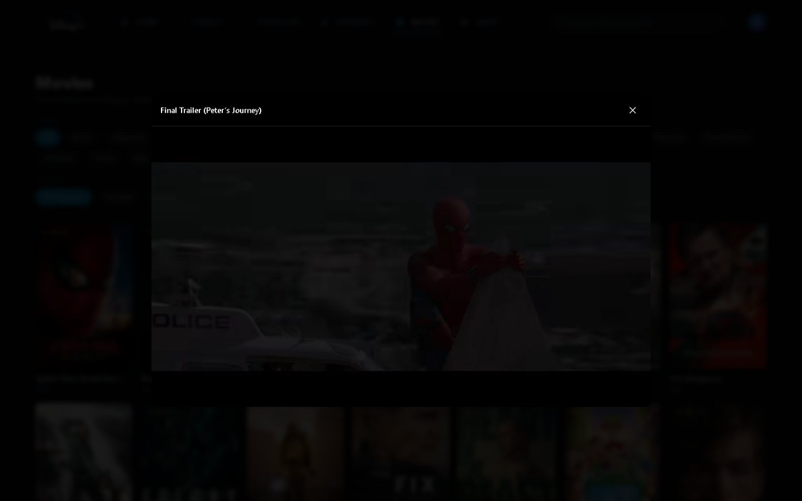

<div align="center">

# ReelStream

**A streaming interface for browsing and discovering movies and series.**
Powered by the [TMDb API](https://www.themoviedb.org/).

[](https://0x-shadow.github.io/reelstream/)
[](https://react.dev/)
[](https://tailwindcss.com/)
[](#license)

[Home](https://0x-shadow.github.io/reelstream/) · [Source](https://github.com/0x-Shadow/reelstream)

</div>

---

## Preview



## What it does

ReelStream is a responsive front end for a movie and series catalogue. Browse trending
titles, search the full catalogue, filter by genre and studio, and keep a personal watch
list that survives a page reload.

| | |
|---|---|
| **Trending hero** | Scroll-snap carousel with per-title metadata and keyboard arrow-key control |
| **Detail view** | Backdrop artwork, synopsis, rating, runtime, genres, real cast, and a *More like this* row |
| **Trailers** | Plays the official trailer for any title in an embedded player |
| **Watch list** | Saved to `localStorage`, with live counters in the header and tab bar |
| **Search** | Debounced live search across movies and series, URL-synced so results are shareable |
| **Browse** | 19 genre filters, three sort orders, and infinite scroll |
| **Studio pages** | Disney, Pixar, Marvel, Star Wars and National Geographic catalogues |
| **Responsive** | Verified from 320px phones to 2560px desktops, with a bottom tab bar on mobile |

## Screens

<table>
<tr>
<td width="50%"></td>
<td width="50%"></td>
</tr>
<tr>
<td></td>
<td></td>
</tr>
<tr>
<td></td>
<td></td>
</tr>
</table>

## Tech stack

- **React 18** — components, hooks, context
- **Tailwind CSS 3** — styling, with `tailwind-scrollbar` for custom scroll areas
- **Axios** — TMDb requests, with a custom param serializer
- **react-icons** — icon set
- **Create React App** — build tooling and dev server
- No UI framework, no state library — routing and the watch list are ~40 lines of hand-written hooks

## Getting started

You need a free TMDb API read access token. Request one at
[themoviedb.org/settings/api](https://www.themoviedb.org/settings/api).

```bash
git clone https://github.com/0x-Shadow/reelstream.git
cd reelstream
npm install
```

Create a `.env` file in the project root. The quickest way is to copy the example:

```bash
cp .env.example .env
```

Then set the token:

```env
REACT_APP_TMDB_READ_TOKEN=your_tmdb_api_read_access_token_here
```

Start the dev server:

```bash
npm start
```

The app opens at `http://localhost:3000`. If the token is missing the app shows a setup
screen with instructions instead of a wall of failed requests.

> **On secrets:** every `REACT_APP_*` value is inlined into the client bundle at build time,
> so it is readable by anyone who loads the page. That is fine here, because a TMDb *read
> access token* is issued for exactly this kind of public, read-only client use. Never put a
> private key, database password, or TMDb *API write* key in a `REACT_APP_` variable — for
> those you need a small proxy server. `.env` is listed in `.gitignore` so it will never be
> committed.

## Project structure

```
src/
├── Components/        # UI: hero, rows, cards, modals, header, tab bar
│   ├── DetailModal.js # title details, cast, similar titles
│   └── TrailerModal.js# YouTube trailer player
├── Context/
│   └── WatchlistContext.js  # localStorage-backed watch list
├── Pages/             # Home, Search, Browse, Originals, WatchList, StudioPage
├── Constant/
│   ├── GenresList.js  # genre id -> name
│   ├── ImageUrls.js   # TMDb image size helpers
│   └── Studios.js     # studio -> TMDb company / network ids
├── services/
│   └── GlobalApi.js   # all TMDb endpoints + error messages
└── utils/             # hash router, media normaliser, formatters
```

## Notes on the TMDb API

A few things learned while building this that are easy to get wrong:

- **`with_company` does nothing.** The singular form is silently ignored and returns the
  unfiltered catalogue. Only `with_companies` (plural) actually filters.
- **Range filters use dot notation.** `vote_average.gte=8`, not `vote_average[gte]=8`.
  `GlobalApi.js` ships a custom `paramsSerializer` to handle this.
- **Verified studio ids.** Company ids: Pixar `3`, Marvel `420`, Lucasfilm `1`, Walt Disney
  Animation `521`, Walt Disney Pictures `2`. Network ids: Disney+ `2739`, National
  Geographic `43`. The `/tv/networks` endpoint returns 404 for read tokens, so these were
  derived from individual show records.
- **Artwork sizes matter.** Posters load at `w500` and backdrops at `w780` rather than
  `original`, which is several times larger for no visible gain on cards.
- **Attribution is required.** TMDb asks that credit is given and that it is clear the app is
  not endorsed by them. See the credits below.

## Scripts

| Command | Description |
|---|---|
| `npm start` | Start the dev server |
| `npm run build` | Create an optimised production build |
| `npm test` | Run the test suite |
| `npm run deploy` | Build and publish to GitHub Pages |

## Deployment

The project is published with GitHub Pages. To deploy your own fork, update the `homepage`
field in `package.json` to your repository URL, then:

```bash
npm run deploy
```

## Credits

This product uses the [TMDB API](https://www.themoviedb.org/) but is not endorsed or
certified by TMDB. Poster and backdrop artwork belongs to TMDb and the respective studios and
copyright holders; the Disney, Pixar, Marvel, Star Wars and National Geographic marks are
the property of their respective owners and are used here for a non-commercial demo.

The original UI concept that this project grew out of came from the
[G-nizam-A/Disney-Plus-Hotstar-Clone](https://github.com/G-nizam-A/Disney-Plus-Hotstar-Clone)
tutorial. The routing, watch list, detail view, trailer player, browse pages, responsive
work and everything in this repository since then were written for this project.

## License

Released under the [MIT License](LICENSE). You are welcome to use, modify and redistribute
this code for your own projects.
